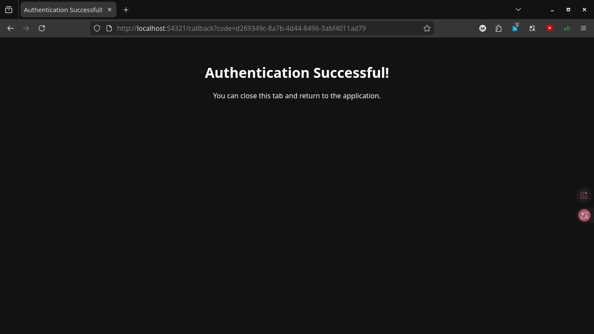
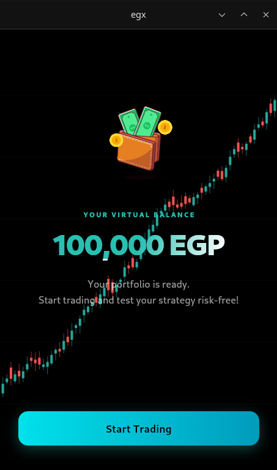
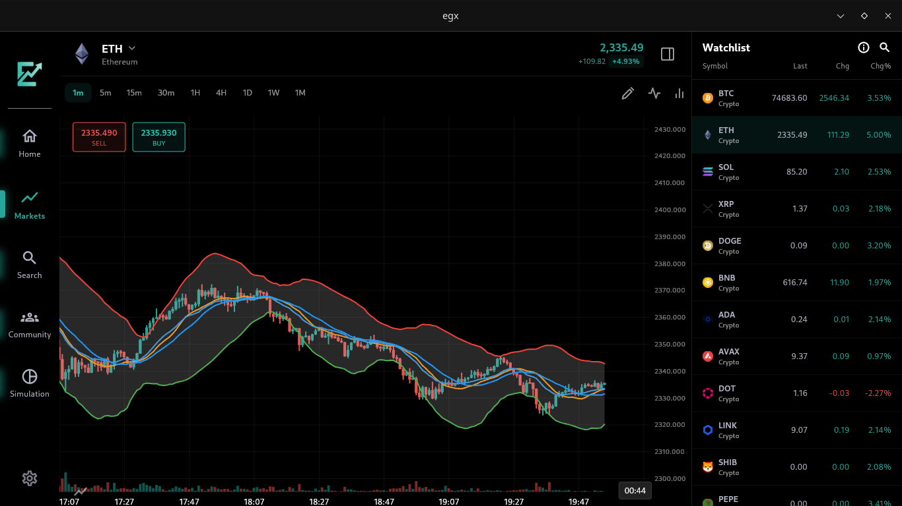
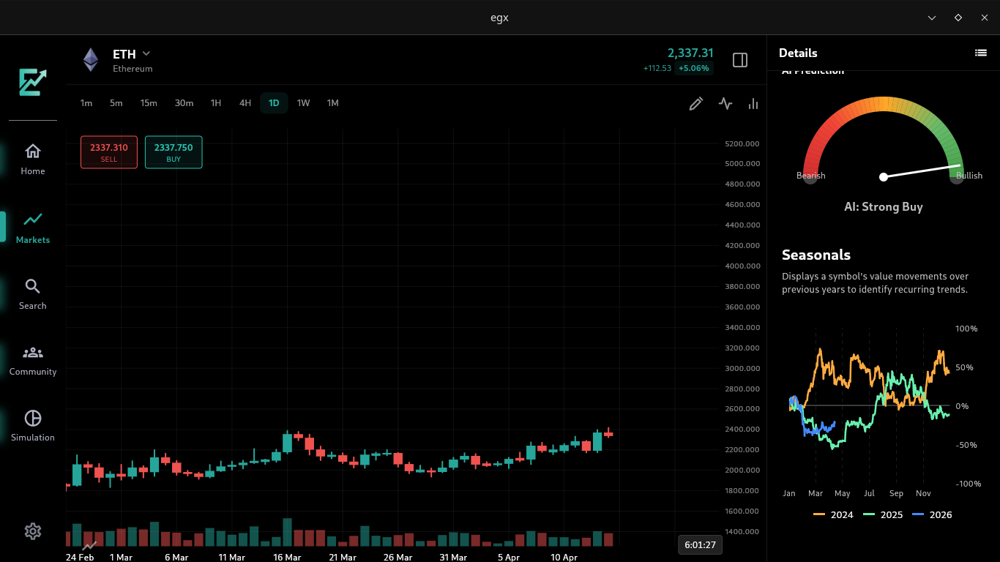

<div align="center">

# 🇪🇬 EGX 360
### Intelligent Financial Markets Platform

**A comprehensive stock market analysis, real-time trading data, and AI-powered financial assistant for the Egyptian Exchange (EGX) and global markets.**

[](https://flutter.dev)
[](https://dart.dev)
[](https://supabase.com)
[](https://firebase.google.com)
[](#license)

</div>

---

## 📖 About

EGX 360 is a cross-platform mobile and desktop application built with Flutter that provides investors and traders with a unified, real-time view of the Egyptian Exchange (EGX), cryptocurrencies, commodities, ETFs, and foreign-exchange rates. The platform consolidates fragmented financial data — scraped from Google Sheets, Finnhub, Binance, Massive, and TradingView — into a single intelligent interface covering **100+ assets** across six asset classes.

### ✨ Key Highlights

| Feature | Description |
|---|---|
| 📊 **Advanced Charting** | Candlestick & area charts with 9+ timeframes, drawing tools, 8 technical indicators |
| 🤖 **AI Chatbot** | Conversational assistant (Cerebras Llama 3.1-8B) with full portfolio context |
| 📈 **Technical Analysis** | Composite engine: EMA, RSI, MACD, Stochastic, Bollinger Bands → Buy/Sell signal |
| 🎯 **AI Prediction Gauge** | ML-based bullish probability displayed as animated semicircular gauge |
| 📰 **News Sentiment Analysis** | AI-powered Arabic & English news with per-article sentiment scoring (Bullish / Bearish / Neutral) |
| 🎓 **Learn (Academy)** | Duolingo-style financial education: XP streaks, interactive modules, lesson maps — Markets, Charting, Investing & more |
| 🏗️ **100+ Assets** | EGX stocks · US stocks · Crypto · ETFs · Materials · USD/FX rates — all in one app |
| 🛢️ **Local Material Prices** | Real-time Egyptian local prices for gold, silver, steel, cement, and other commodities |
| 💼 **Paper Trading** | Full simulation with per-asset risk protection rules (alert + auto-sell) |
| 👥 **Social Community** | Nested threaded comments, real-time stock chat rooms, posts with sentiment tags |
| 🔊 **News + TTS** | Arabic & English text-to-speech news reader with AI summarization |
| 🌐 **Bilingual** | Full Arabic ↔ English support with RTL-aware layouts |
| 🖥️ **Adaptive** | Responsive layouts for mobile, tablet, and desktop (Linux/Windows) |

### 📦 Asset Universe (100+ Assets)

| Asset Class | Count | Sources |
|---|---|---|
| 🇪🇬 EGX Stocks (Egypt) | 70+ | TradingView scraper, Massive, Google Sheets |
| 🇺🇸 US Stocks & ETFs | 15+ | Finnhub API, TradingView |
| ₿ Cryptocurrencies | 10+ | Binance WebSocket & REST |
| 🏅 Materials & Commodities | 10+ | Binance (PAXG, etc.), local price scraper |
| 💵 USD / FX Rates | 5+ | Supabase (aggregated) |
| 📊 ETFs | 5+ | Finnhub, TradingView |

---

## 🏗️ Repository Structure

```
EGX360-Graduation-Project/
├── app/                    # Flutter application (main codebase)
│   ├── lib/                # Dart source code
│   │   ├── core/           # Shared utilities, design system, routing
│   │   └── features/       # 15 feature modules (Clean Architecture)
│   ├── supabase/           # Database schema & migration files
│   └── README.md           # Detailed app documentation
├── aws_automation/         # AWS automation scripts & stock data scraper
├── assets/                 # Images, presentation materials, screenshots
│   └── image/dektop/       # Desktop & mobile app screenshots (42 screens)
├── data_store/             # Data storage configs & exports
├── docs/                   # Project documentation & reports
├── models/                 # ML prediction models
├── presentations/          # Poster, slides, infographics
└── sql_schema/             # SQL database schema definitions
```

> 📋 For a detailed breakdown of the Flutter app architecture, features, and APIs, see [`app/README.md`](app/README.md).

---

## 🚀 Quick Start

### Prerequisites
- Flutter SDK `^3.9.2`
- Supabase project ([supabase.com](https://supabase.com))
- Firebase project ([console.firebase.google.com](https://console.firebase.google.com))
- Cerebras AI API key ([inference.cerebras.ai](https://inference.cerebras.ai))

### Setup

```bash
# 1. Clone
git clone https://github.com/mohaaHeiba/EGX360-Graduation-Project.git
cd EGX360-Graduation-Project/app

# 2. Install dependencies
flutter pub get

# 3. Create .env file (never commit this!)
cat > .env << EOF
SUPABASE_URL=your_supabase_url
SUPABASE_APIKEY=your_supabase_anon_key
CEREBRAS_APIKEY=your_cerebras_key
EOF

# 4. Configure Firebase
dart pub global activate flutterfire_cli
flutterfire configure

# 5. Generate Floor (SQLite) code
flutter pub run build_runner build --delete-conflicting-outputs

# 6. Run
flutter run                        # Development
flutter build apk --release        # Android APK
flutter build linux --release      # Linux Desktop
```

> ⚠️ **Never commit your `.env` file.** It is listed in `.gitignore`. Create it locally only.

---

## 🛠️ Technology Stack

### Frontend
| Technology | Purpose |
|---|---|
| **Flutter** `^3.9.2` | Cross-platform (Android, iOS, Linux, Windows) |
| **GetX** | State management, dependency injection, routing |
| **Syncfusion Flutter Charts** | Candlestick/area charts with trackball |
| **FL Chart** | Sparklines, gauge fills |
| **flutter_markdown** | Markdown rendering in chatbot responses |
| **flutter_tts** | TTS news reader (Arabic + English) |

### Backend & Cloud
| Service | Purpose |
|---|---|
| **Supabase** | Auth, PostgreSQL, Realtime, Storage, Edge RPCs |
| **Firebase** | FCM push notifications |
| **Binance API** | REST + WebSocket crypto/commodity data |
| **Cerebras AI** | Llama 3.1-8B for chatbot, news summarization & sentiment |

### Data Pipeline & Sources
| Asset Type | Source | Update Method |
|---|---|---|
| EGX Stocks | TradingView scraper · Massive · Google Sheets | Scheduled scraper → Supabase |
| US Stocks & ETFs | Finnhub API · TradingView | Scheduled pull → Supabase |
| Cryptocurrencies | Binance WebSocket | Real-time stream |
| Materials / Commodities | Binance (PAXGUSDT) · Local price scraper | Real-time + scheduled |
| FX / USD Rates | Supabase (aggregated) | On-demand fetch |
| News Sentiment | Cerebras AI (per article) | On article fetch |

---

## 🏛️ Architecture

EGX 360 follows **Feature-First Clean Architecture** with three layers per feature:

```
Data Layer  →  Domain Layer  →  Presentation Layer
(APIs/DB)       (Entities,        (GetX Controllers,
                 Repos, UseCases)   Pages, Widgets)
```

**15 Feature Modules**: `assets` · `auth` · `chatbot` · `community` · `home` · `learn` · `markets` · `news_briefing` · `notifications` · `post_details` · `profile` · `search` · `settings` · `simulation` · `stock_chat` · `welcome`

---

## 📸 Screenshots

### 🎓 Learn — Academy (Duolingo-style)

<table>
  <tr>
    <td align="center"><br/><sub>Academy — Lesson Map (locked)</sub></td>
    <td align="center"><br/><sub>Academy — Lesson Map (with progress & XP)</sub></td>
  </tr>
  <tr>
    <td colspan="2" align="center"><br/><sub>Academy — Lesson Content (Hours & Sessions)</sub></td>
  </tr>
</table>

---

### 🖥️ Desktop Application

<table>
  <tr>
    <td align="center"><br/><sub>Loading Screen</sub></td>
    <td align="center"><br/><sub>Welcome / Onboarding</sub></td>
  </tr>
  <tr>
    <td align="center"><br/><sub>Authentication</sub></td>
    <td align="center"><br/><sub>Success State</sub></td>
  </tr>
  <tr>
    <td align="center"><br/><sub>Onboarding Step 1</sub></td>
    <td align="center"><br/><sub>Onboarding Step 2</sub></td>
  </tr>
  <tr>
    <td align="center"><br/><sub>Onboarding Step 3</sub></td>
    <td align="center"><br/><sub>Onboarding Step 4</sub></td>
  </tr>
  <tr>
    <td align="center"><br/><sub>Home Dashboard</sub></td>
    <td align="center"><br/><sub>Home — Market Overview</sub></td>
  </tr>
  <tr>
    <td align="center"><br/><sub>AI Chatbot</sub></td>
    <td align="center"><br/><sub>AI Chatbot — Conversation</sub></td>
  </tr>
  <tr>
    <td align="center"><br/><sub>News Feed with Sentiment Analysis</sub></td>
    <td align="center"><br/><sub>Markets Overview</sub></td>
  </tr>
  <tr>
    <td align="center"><br/><sub>Markets — Chart View</sub></td>
    <td align="center"><br/><sub>Markets — Candlestick Chart</sub></td>
  </tr>
  <tr>
    <td align="center"><br/><sub>Markets — Technical Analysis</sub></td>
    <td align="center"><br/><sub>Markets — AI Prediction Gauge</sub></td>
  </tr>
  <tr>
    <td align="center"><br/><sub>Markets — Indicators</sub></td>
    <td align="center"><br/><sub>Markets — Drawing Tools</sub></td>
  </tr>
  <tr>
    <td align="center"><br/><sub>Markets — Order Sheet</sub></td>
    <td align="center"><br/><sub>Markets — Stock Details</sub></td>
  </tr>
  <tr>
    <td align="center"><br/><sub>Markets — Seasonality</sub></td>
    <td align="center"><br/><sub>Markets — Sidebar</sub></td>
  </tr>
  <tr>
    <td align="center"><br/><sub>Markets — Crypto</sub></td>
    <td align="center"><br/><sub>Markets — FX / USD Rates</sub></td>
  </tr>
  <tr>
    <td align="center"><br/><sub>Search (100+ Assets)</sub></td>
    <td align="center"><br/><sub>Community Feed</sub></td>
  </tr>
  <tr>
    <td align="center"><br/><sub>Community — Post Details</sub></td>
    <td align="center"><br/><sub>Community — Comments</sub></td>
  </tr>
  <tr>
    <td align="center"><br/><sub>User Profile</sub></td>
    <td align="center"><br/><sub>Simulation — Portfolio</sub></td>
  </tr>
  <tr>
    <td align="center"><br/><sub>Simulation — Transactions</sub></td>
    <td align="center"><br/><sub>Settings</sub></td>
  </tr>
  <tr>
    <td align="center"><br/><sub>Asset Detail — Overview</sub></td>
    <td align="center"><br/><sub>Asset — News & Sentiment Tab</sub></td>
  </tr>
  <tr>
    <td align="center"><br/><sub>Asset — Community Tab</sub></td>
    <td align="center"><br/><sub>Asset — Live Chat</sub></td>
  </tr>
</table>

---

## 🔮 Future Improvements

- **Price Alerts** — User-set price-target push notifications
- **Social Trading** — Copy-trade from top performers
- **Export** — Portfolio report as PDF/CSV
- **Advanced Analytics** — Sharpe ratio, beta, correlation matrix
- **Chart Pattern Recognition** — Automated candlestick pattern detection
- **Home-screen Widgets** — Quick market glance widget
- **More Learn Modules** — Expand Academy to cover Options, Forex, and Portfolio Theory

---

## 👨‍💻 Author

**Developer**: Mohamed Heiba
**GitHub**: [@mohaaHeiba](https://github.com/mohaaHeiba)
**Institution**: Kafr El-Sheikh University (KSIU)
**Email**: mohamed222101223@ksiu.edu.eg
**Academic Year**: 2024–2025

---

## 🙏 Acknowledgments

- **Supabase** — Backend, database, Realtime, storage
- **Firebase** — Push notification infrastructure
- **Binance** — Crypto/commodity market data APIs
- **Finnhub** — US stocks & ETF data
- **TradingView / Massive / Google Sheets** — EGX stock data pipeline
- **Cerebras AI** — LLM inference for chatbot, summarization & sentiment analysis
- **Syncfusion** — Flutter charting components
- **Flutter Community** — Open source packages ecosystem

---

## 📄 License

This project is developed as a graduation project for academic purposes.

---

<div align="center">

**EGX 360** · Built with ❤️ using Flutter · 2024–2025

</div>
